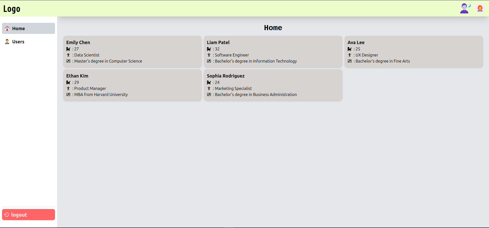
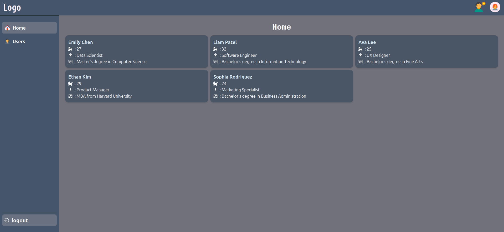
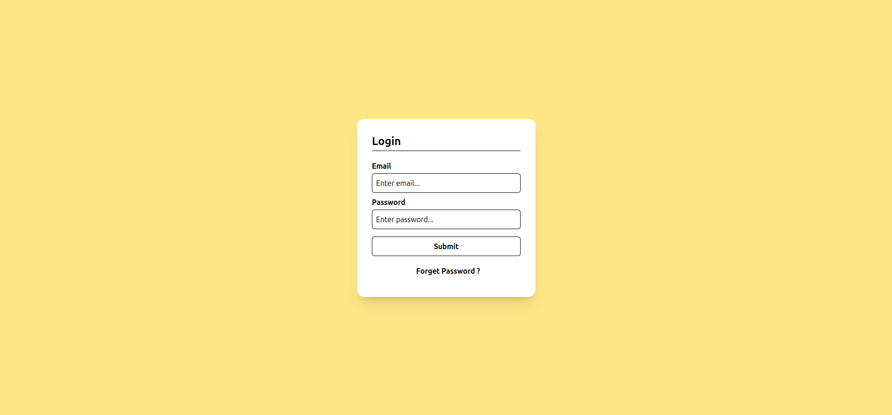

# Dashboard Project

A modern dashboard built with React, TypeScript, Vite, and Tailwind CSS.

## Overview

This project is a sample dashboard that demonstrates a clean and responsive design. It's built using the latest technologies, including React, TypeScript, Vite, and Tailwind CSS.

## Features

* **Responsive Design**: The dashboard is fully responsive and works well on different devices and screen sizes.
* **Modern UI**: The dashboard features a modern and clean UI, built with Tailwind CSS.
* **Type Safety**: The project uses TypeScript for type safety and better code maintainability.
* **Fast Development**: Vite provides fast development and hot reloading.

## Technologies Used

* **React**: A popular JavaScript library for building user interfaces.
* **TypeScript**: A superset of JavaScript that adds optional static typing.
* **Vite**: A fast and lightweight development server.
* **Tailwind CSS**: A utility-first CSS framework for building custom user interfaces.

## Getting Started

### Prerequisites

* Node.js (17 or higher)
* npm or yarn

### Installation

1. Clone the repository: `git clone https://github.com/your-username/dashboard-project.git`
2. Install dependencies: `npm install` or `yarn install`
3. Start the development server: `npm run dev` or `yarn dev`

### Build and Deployment

1. Build the project: `npm run build` or `yarn build`
2. Deploy the project to your preferred hosting platform.

### Light Theme

### Dark Theme

### Login screen

## About

Project Create by Kavali Surya Teja

